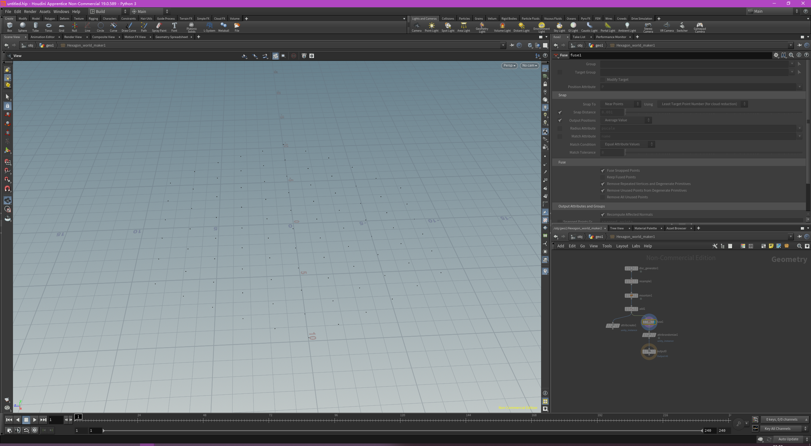
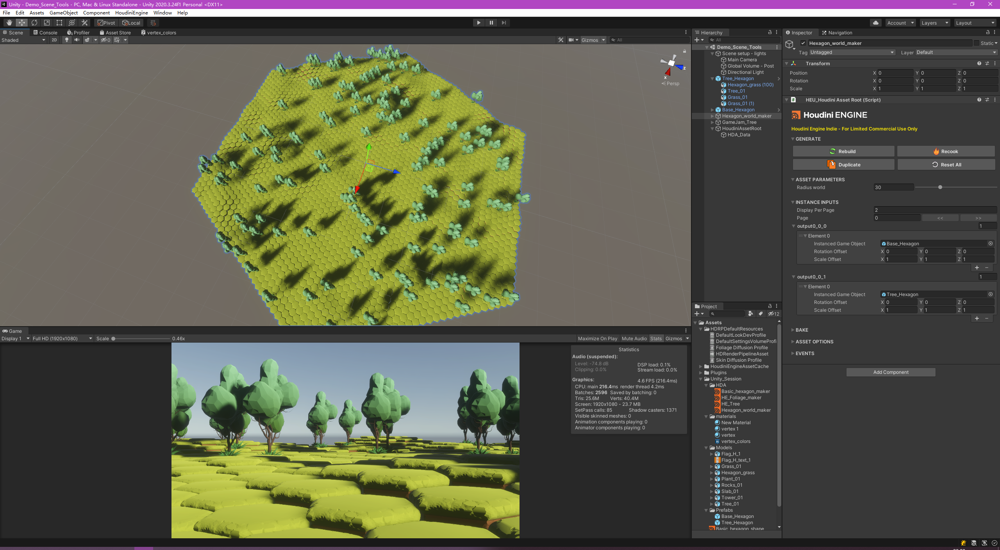

来自Houdini官方的教程： https://www.youtube.com/watch?v=aWAde8N59xE&t=1s

视频末尾有环境部署的教程

需要注意的是，免费许可（HOUDINI APPRENTICE）是没有办法导出HDA给Houdini Engine For Unity用的，因为Houdini Engine For Unity只认商业版的Houdini导出的HDA。

说白了，就是如果你想要自己在Houdini制作并导出HDA，就得花钱买商业版，最便宜的（HOUDINI INDIE）一年要1.2k左右：https://www.sidefx.com/buy/#houdini-indie