来自Houdini官方的教程： https://www.sidefx.com/tutorials/unity-starter-kit/

遇到一些编辑问题时，可以尝试点一下ReBuild按钮

## 合集视频教程地址

https://www.youtube.com/watch?v=Ie10EwVLj00&list=PLXNFA1EysfYl0noIUdMUSsG-TOpkm0-CQ

## [烘焙HDA为Prefab/GameObject](https://www.youtube.com/watch?v=3vEruVSf8kc&list=PLXNFA1EysfYl0noIUdMUSsG-TOpkm0-CQ&index=2)

Houdini Engine For Unity（以下简称HEFU）可以将HDA输出内容烘焙成Gameobject或者Prefab，从而更加方便直接的进行复用

此外，还支持将已经烘焙好的Go或者Prefab拖拽到 Drag & drop GameObjects/Prefabs: 从而使用新的HDA参数进行同步更新

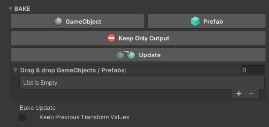

## [Boolean边缘破坏](https://www.youtube.com/watch?v=cpIbKQm6WBM&list=PLXNFA1EysfYl0noIUdMUSsG-TOpkm0-CQ&index=7)

这个HDA功能是组合多个模型然后进行边缘破坏，达成做旧的效果

值得注意的是Input的参数面板

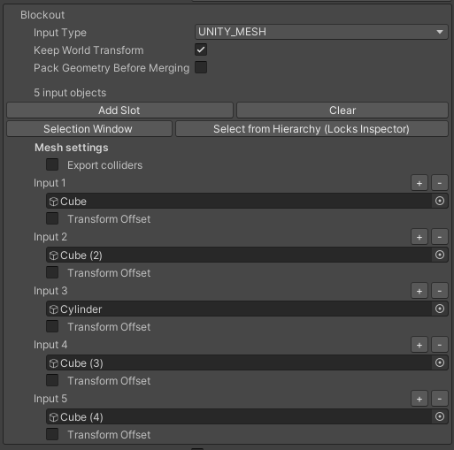

看起来这么复杂的面板，其实在Houdini里只是一个built-in参数而已，完全不需要进行任何处理，比如我新增一个Label

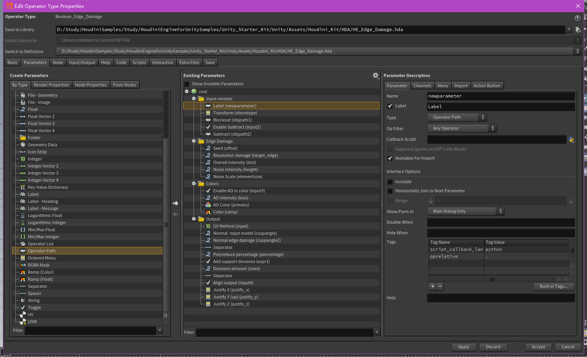

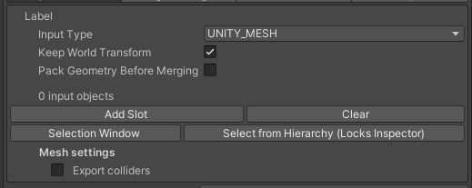

## [Tree Tool](https://www.youtube.com/watch?v=rghCh8A4LXg&list=PLXNFA1EysfYl0noIUdMUSsG-TOpkm0-CQ&index=3)

非常不错的曲线编辑器和树杈生成算法

曲线编辑来自Curve SOP，需要注意在Houdini里将Curve SOP设置为可编辑Node（可编辑Node可以为多个，但除Curve SOP之外的Node是否能在Unity Inspector可视化出来取决于HEFU是否为其开发了编辑器拓展）

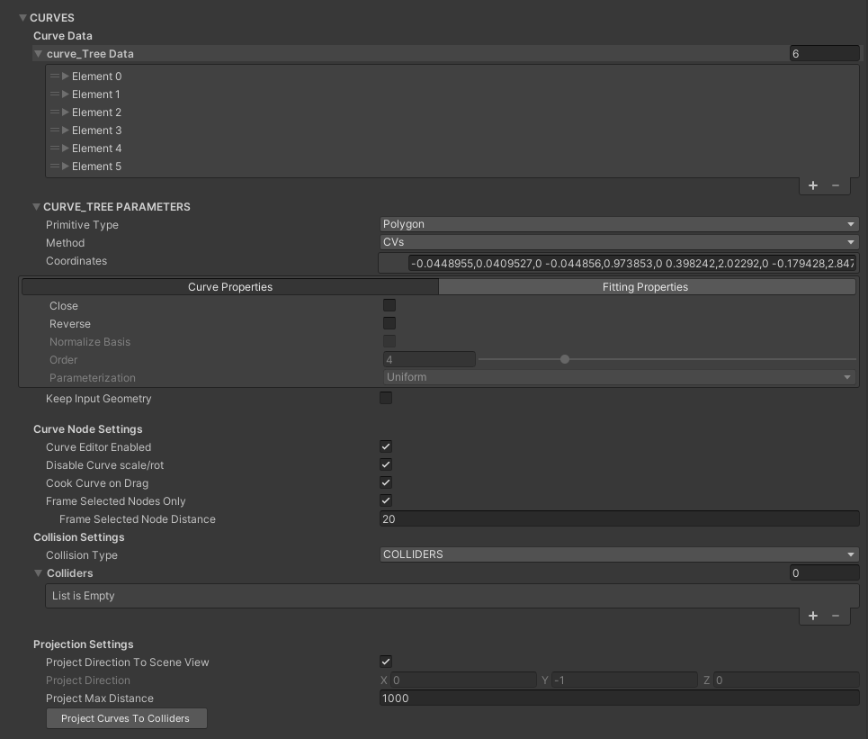

## [岩石工具](https://www.youtube.com/watch?v=l3akQ1x5vzQ&list=PLXNFA1EysfYl0noIUdMUSsG-TOpkm0-CQ&index=4)

未做polyreduce + 内部剔除的基础上，顶点数和面数实在有点。。。

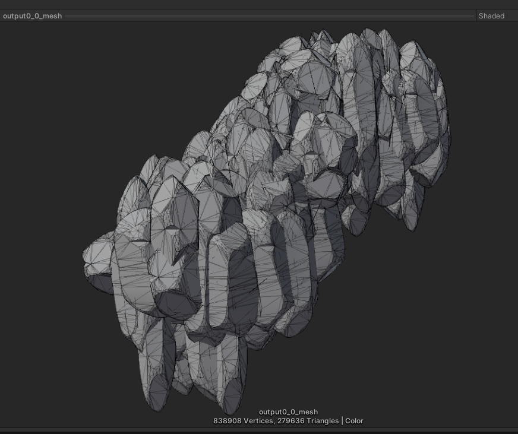

参照 https://zhuanlan.zhihu.com/p/55982770 对内部图元进行裁剪后，可以得到一个比较好的结果，但是需要注意的是，这种裁剪可能会导致一些漏洞出现（因为是基于Voxel的裁剪再加上模型的非封闭性，很难保证所有待裁剪图元都在模型内。。。）

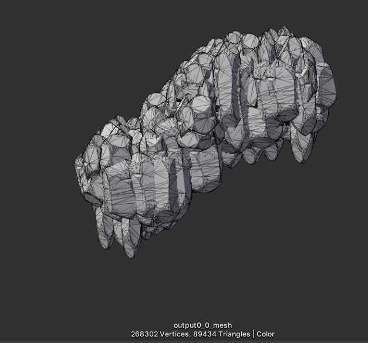

再加上PolyReduce优化，嗯，虽然还是很超模，但已经好很多了，缩减了10倍左右，这也勉强算是程序化的一个缺点吧

## [模块化墙壁工具](https://www.youtube.com/watch?v=95-gmPzMgiE&list=PLXNFA1EysfYl0noIUdMUSsG-TOpkm0-CQ&index=5)

这个其实没什么好说的，就是Houdini工程值得好好学习下

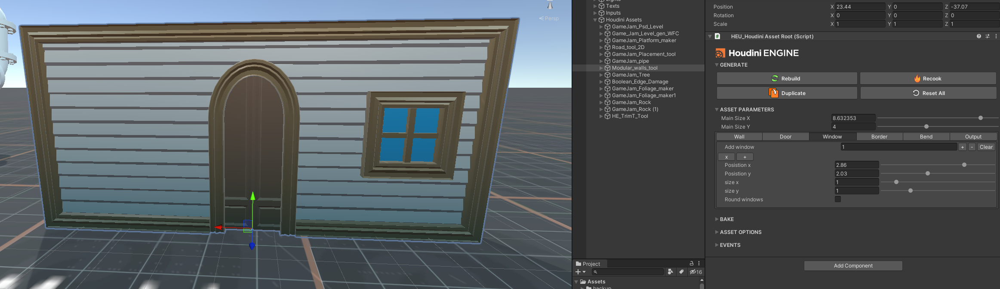

## [树叶/藤蔓工具](https://www.youtube.com/watch?v=pTJtI4vymag&list=PLXNFA1EysfYl0noIUdMUSsG-TOpkm0-CQ&index=6)

有个相当有意思的种植效果，可以研究下

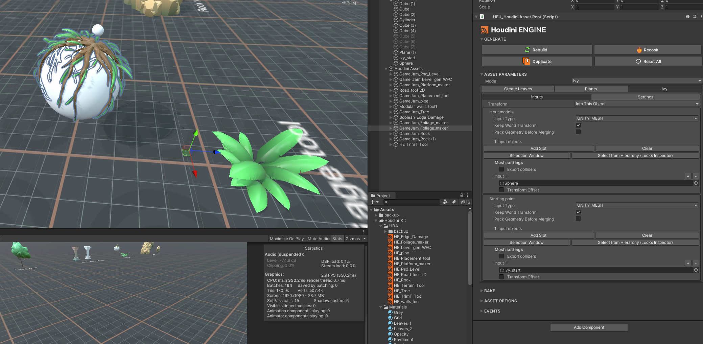

## [PSD生成关卡工具](https://www.youtube.com/watch?v=RCD0zLM-vi4&list=PLXNFA1EysfYl0noIUdMUSsG-TOpkm0-CQ&index=8)

相当方便的快速关卡模型编辑器

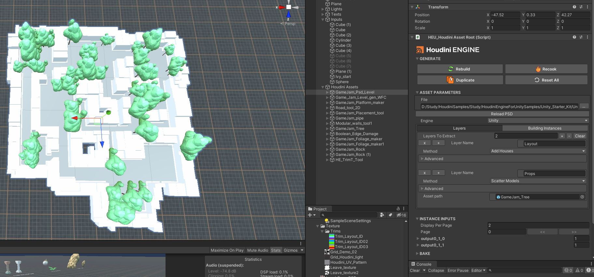

## [放置工具](https://www.youtube.com/watch?v=mTbQN5OuOhk&list=PLXNFA1EysfYl0noIUdMUSsG-TOpkm0-CQ&index=9)

## [波函数坍缩生成关卡](https://www.youtube.com/watch?v=mgWftkTq1XU&list=PLXNFA1EysfYl0noIUdMUSsG-TOpkm0-CQ&index=10)

可以自由选择区域，程序会自动帮忙链接，但是WFC好像有点问题用不了。。。

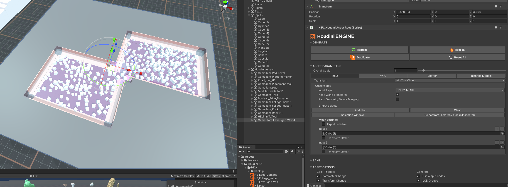

## [Trim Tool](https://www.youtube.com/watch?v=cq_d-ZppqdI)